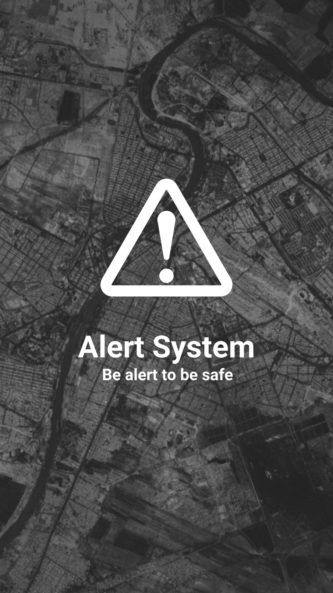
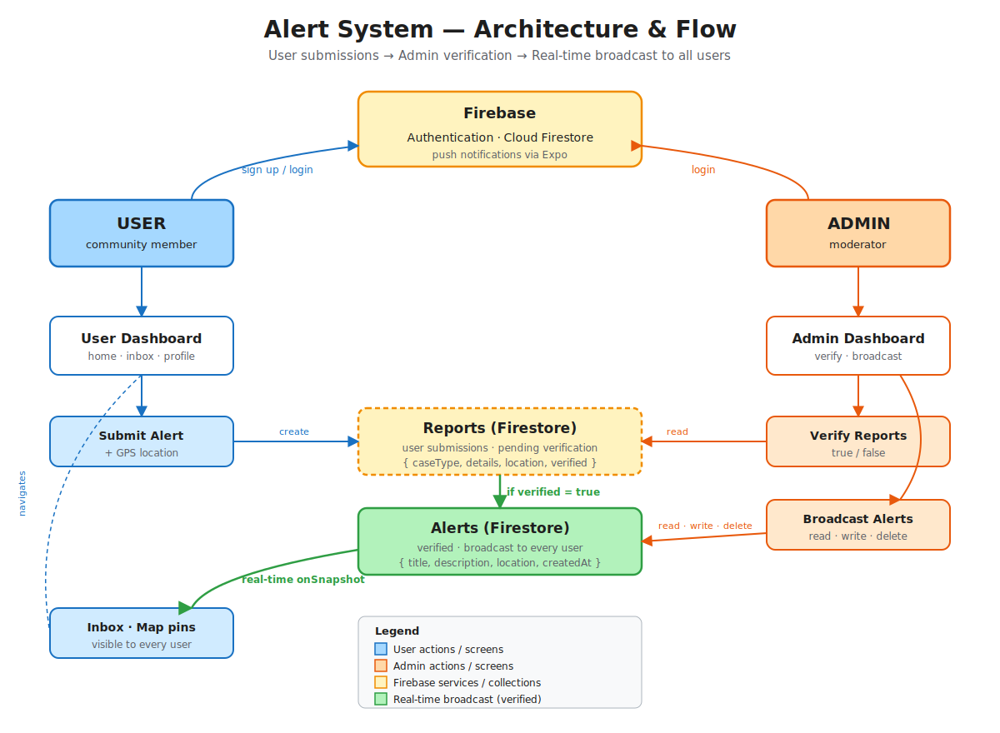

# Alert System (`myalertApp`)

> **Be alert to be safe** — a community safety mobile app where citizens can report incidents, view nearby cases on a map, and receive real‑time broadcast alerts from administrators.

<p align="center">
  
</p>

<p align="center">
  
  
  
  
  
</p>

---

## Overview

`myalertApp` is a cross‑platform mobile application I built with **Expo / React Native** and **Firebase**. It connects citizens and authorities so that incidents (crimes, natural disasters, health emergencies, etc.) can be reported, verified, and broadcast back to the community in real time.

The app ships with two distinct experiences:

- **User app** — sign up, file geo‑tagged reports, browse a live map of verified cases and alerts, and receive push notifications.
- **Admin console** — review incoming reports, verify them, and broadcast alerts that immediately appear on every user's device.

---

## Highlights for recruiters

- **End‑to‑end product**: auth, data model, real‑time sync, maps, push notifications, and an admin workflow — all built and wired together.
- **Real‑time data** with Firestore `onSnapshot` listeners — alerts pushed by admins appear on user devices without a refresh.
- **Location features** using `expo-location`: GPS capture for new reports plus reverse geocoding to a human‑readable address.
- **Native maps** with `react-native-maps` rendering two layers of markers (verified user reports + admin broadcasts) over the user's live location.
- **Push notifications** via `expo-notifications` with platform‑specific Android channel setup.
- **Role‑based routing** with `expo-router` file‑based routes (`(tabs)` for users, `admin/` stack for moderators).
- **Authentication** with Firebase Auth (email/password) and persisted session via `onAuthStateChanged`.

---

## Tech stack

| Area | Tools |
| --- | --- |
| App framework | React Native 0.76, Expo SDK 52, expo‑router 4 |
| Language | TypeScript + JavaScript |
| Backend | Firebase Auth, Cloud Firestore |
| Maps & location | `react-native-maps`, `expo-location`, `react-native-google-places-autocomplete` |
| Notifications | `expo-notifications`, `expo-device` |
| Storage | `expo-secure-store`, `@react-native-async-storage/async-storage` |
| Build / release | EAS Build, `eas.json` configuration |

---

## Features

### User experience
- **Login / Sign‑up** with Firebase Auth and persistent sessions.
- **Home feed** with a header, slider, and call‑to‑action banner.
- **New Report** form that captures: name, ID, contact, gender, case type (Crimes, Natural Disasters, Health, Others), free‑text details, GPS coordinates, and a reverse‑geocoded address.
- **Past Reports** screen listing all reports the user has filed, with the ability to drill into a single report.
- **Live Map** showing two pin types — blue pins for verified citizen reports, red pins for admin alerts — centered on the user's current location.
- **Inbox** subscribed to the `Alerts` collection in real time so new broadcasts appear instantly.
- **Profile** with avatar, name, email, navigation to feedback / past reports, and logout.

### Admin experience
- **Admin login** routed to a separate `admin/` stack.
- **Dashboard** with two primary actions: *Report Verification* and *Broadcast Alert*.
- **Report Verification** lists every submitted report with verified / unverified and opened / unopened status; tapping a report opens a detail view and marks it as opened.
- **Broadcast Alert** lists past alerts and lets the admin compose a new alert that is written straight to Firestore — and instantly fanned out to user devices.

---

## Architecture

<p align="center">
  
</p>

```
app/
├─ (tabs)/                # User-facing tabs: home, maps, inbox, reports, profile
├─ admin/                 # Admin stack: dashboard, verification, broadcast, create alert
├─ login/                 # Sign in / sign up
├─ new_report/            # New report form
├─ report_details/        # Single report viewer
├─ feedback/              # User feedback form
├─ index.tsx              # Auth gate — redirects to /login or /(tabs)/home
└─ _layout.tsx            # Root stack
components/Home/          # Header & slider used by the home tab
firebase.js               # Firebase app + Firestore initialization
```

**Data model (Firestore)**

- `Users/{uid}/Reports/{reportId}` — reports filed by a specific user.
- `Reports/{reportId}` — global collection used by the admin verification queue.
- `Alerts/{alertId}` — broadcasts published by admins; subscribed to in real time by every user.

**Auth gate** — `app/index.tsx` listens to `onAuthStateChanged` and redirects unauthenticated users to `/login` and authenticated users to `/(tabs)/home`.

---

## Screenshots

> The visual brand assets are checked into `assets/images/`. Drop your own captures into a `docs/screenshots/` folder and update the table below — the placeholders are wired up and ready.

### Brand

| Splash | App icon (iOS) | App icon (Android) |
| :---: | :---: | :---: |
|  |  |  |

### User flow

| Login | Home | Map | Inbox | Profile |
| :---: | :---: | :---: | :---: | :---: |
| _add `docs/screenshots/login.png`_ | _add `docs/screenshots/home.png`_ | _add `docs/screenshots/map.png`_ | _add `docs/screenshots/inbox.png`_ | _add `docs/screenshots/profile.png`_ |

### Admin flow

| Admin login | Dashboard | Report verification | Broadcast alert |
| :---: | :---: | :---: | :---: |
| _add `docs/screenshots/admin-login.png`_ | _add `docs/screenshots/admin-dashboard.png`_ | _add `docs/screenshots/admin-verify.png`_ | _add `docs/screenshots/admin-broadcast.png`_ |

### Map markers

| Verified report | Admin alert |
| :---: | :---: |
|  |  |

---

## Getting started

```bash
# 1. Install dependencies
npm install

# 2. Add your Firebase config
#    - firebase.js
#    - GoogleService-Info.plist (iOS)
#    - google-services.json (Android)

# 3. Start the dev server
npx expo start
```

From the Expo CLI you can launch the app on:

- a **development build** (recommended)
- the **iOS simulator** (`i`) or **Android emulator** (`a`)
- a physical device through the Expo Go app

Production builds are configured via `eas.json` and the project ID in `app.json`.

---

## What I learned building this

- Designing a single codebase that exposes two completely different role‑based UIs.
- Modelling a Firestore schema that supports both per‑user and global queries without duplicating data.
- Wiring `expo-notifications` and Android notification channels for production push.
- Combining `expo-location` reverse geocoding with `react-native-maps` to give both human‑readable addresses *and* accurate map pins.
- Using `expo-router`'s file‑based routing to keep the user, admin, and auth flows cleanly separated.
